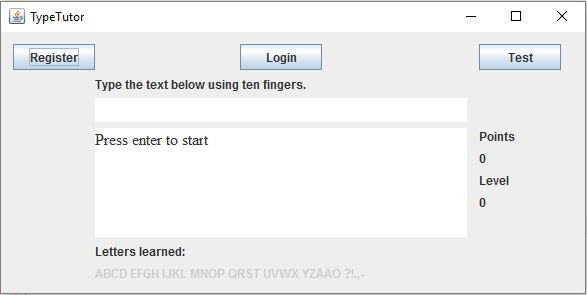

# Käyttöohje

TypeTutorin käyttö aloitetaan klikkaamalla hiiri kohtaan, jossa lukee "Press enter to start". Paina ohjeen mukaan enteriä, jolloin tyhjälle riville tulee tekstiä, joka sinun tulee kirjoittaa kymmensormijärjestelmällä.

Jokaisesta oikeasta kirjaimesta saat pisteen ja vastaavasti väärästä menetät pisteet. Kun olet harjoitellut jonkin aikaa ja saanut tarpeeksi pisteitä, pääset seuraavalle tasolle harjoittelemaan lisää kirjaimia. Kirjoitusruudun alapuolella näet kirjaimet, jotka jo osaat.
Opit kirjoittamaan myös isot kirjaimet ja välimerkit.

Mukavaa harjoittelua!